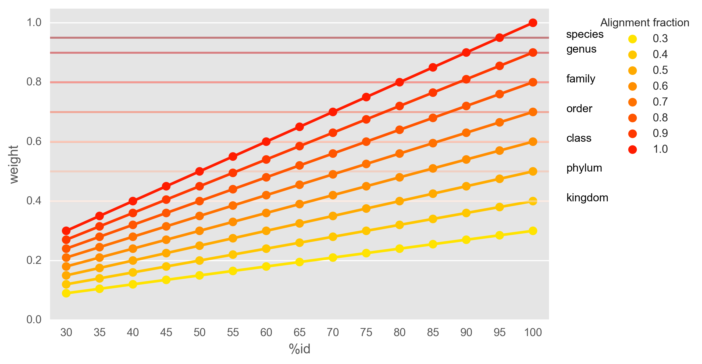

Annotation of coding sequences
==============================

This section deals with how to annotate protein sequences predicted on
assembled contigs.

Protein family annotation
-------------------------
Annotation of predicted protein coding sequences is performed using the tool
`eggnog-mapper <https://github.com/jhcepas/eggnog-mapper>`_ and/or
`pfam_scan <https://www.ebi.ac.uk/Tools/pfa/pfamscan/>`_ (using the latest version of the PFAM database).

:code:`eggnog:` Set to True in order to annotate coding sequences with eggnog-mapper. This also adds annotations for KEGG orthologs, modules and pathways.

:code:`pfam:` Set to True in order to add PFAM protein families to coding sequences.

.. note:: Both eggnog-mapper and pfam-scan run on separate conda environments. In order to use these tools you must run the workflow with the :code:`--use-conda` flag.

Taxonomic annotation
--------------------
Taxonomic annotation of protein sequences is performed by:
1. similarity searches against a reference database
2. parsing best hits for each protein query and linking hits to taxonomic IDs
3. assigning a taxonomic label to the lowest common taxa for the 'best hits'

(Actually in this workflow, contigs are assigned a taxonomy based on
the lowest common ancestor of the classified proteins on the contig,
and then this contig-taxonomy is applied to all proteins on the contig)

The first step above is performed in this workflow using
`Diamond <https://github.com/bbuchfink/diamond/>`_ against a protein sequence
reference database (see more on this below).

:code:`taxonomic_annotation:` Set to True to run the diamond search step and taxonomic assignment of protein sequences using
the database of your choice.

:code:`diamond_dbpath:` Path to where the diamond formatted database will be stored.

:code:`diamond_dbtype:` Can be one of 'nr', 'uniref50', 'uniref90', 'uniref100'

:code:`diamond_threads`: How many threads to use for the diamond blast job.

Methodology
^^^^^^^^^^^
The assignment of taxonomy in the second and third steps is based on
a method originally introduced in
the `DESMAN <https://github.com/chrisquince/DESMAN>`_ package. Briefly this
is done as follows: hits reported by diamond are weighted (ranging from 0-1)
based on the alignment fraction and %identity of the hit. The method then
attempts to assign a taxonomy for each query protein, starting at the
species level and then moving up to higher taxonomic ranks. At each rank,
only hits with weights exceeding a rank-specific threshold are considered.
By default these thresholds are set at: species = 0.95, genus = 0.9,
family = 0.8, order = 0.7, class = 0.6, phylum = 0.5, superkingdom = 0.4.
At each rank, if the sum of weights for one taxon is greater than half the
total sum of weights then that taxon is assigned to the query. Higher
taxonomic ranks (if any) are inferred directly from that taxon while
lower ranks are given the taxon name prefixed with "Unclassified." (e.g.
Unclassified.Proteobacteria").

The plot below shows how the weights of hits relates to the %id of the
hit as well as the alignment fraction of the query to the hit.

Deciding which blast database to use
^^^^^^^^^^^^^^^^^^^^^^^^^^^^^^^^^^^^
Ideally we'd like to assign species-level taxonomy to all the protein sequences in our analysis but metagenomics
doesn't often allow that. This is partly a database/data issue since reference databases are not good representatives of
the taxa being studied. A lot of times the best taxonomic annotation a protein sequence can get is at genus level.

Since the similarity search step can be a bottleneck it
may be worthwhile to use a **clustered** reference database such as `UniRef <http://www.uniprot.org/help/uniref>`_.
In UniRef, protein sequences in the UniProt database are clustered by % sequence identity using the
`CD-HIT <http://weizhongli-lab.org/cd-hit/>`_ software and a *seed* sequence is selected for each cluster.

For instance, in UniRef90 sequences are clustered at 90% sequence identity. In the 2017_08 release of UniProt/UniRef
this reduces the number of sequences from 89,951,742 in the UniProt database to 59,207,328 in the UniRef90 database.
Consequently, searching the UniRef90 database instead of the full UniProt database (or the NCBI nr database) will be a
lot faster. The drawback is that the taxonomic annotation may not be as sensitive.

Conveniently, each entry in UniRef database contains information on the lowest common taxa for all sequences contained
in the cluster. So we can evaluate the number of unique taxa at each taxonomic rank in the databases.

Below is a comparison of unique taxa at the genus and species level
for Archaea, Bacteria, Eukaryota and Viruses in all the UniRef databases
as well as in the full NCBI non-redundant database.

 .. image:: ../img/tax_database_comparison.png
    :width: 400
    :alt: Blast databases

Generating required database files
==================================

Several steps of this workflow requires large database files that may take
a long time to download and format. If you want to can run the database
creation separately with the workflow (e.g. while you're waiting for real
data to arrive).

To create the databases needed for the protein annotation steps (eggnog, pfam and taxonomic) you can run::

    snakemake --configfile config.yaml --config eggnog=True pfam=True taxonomic_annotation=True -np db

    <lots of text>

    Job counts:
        count   jobs
        1       db
        1       db_done
        1       download_eggnog
        1       download_pfam
        1       download_pfam_info
        1       download_uniref
        1       get_eggnog_version
        1       get_kegg_ortholog_info
        1       prepare_diamond_db_uniref
        1       prepare_taxfiles_uniref
        1       press_pfam
        11

.. note:: The 'db' target only includes database files used in preprocessing (SortMeRNA) and protein annotation.

.. seealso:: See the documentation for ways to create databases for `read-classification <http://nbis-metagenomic-workflow.readthedocs.io/en/latest/classification/index.html>`_.

