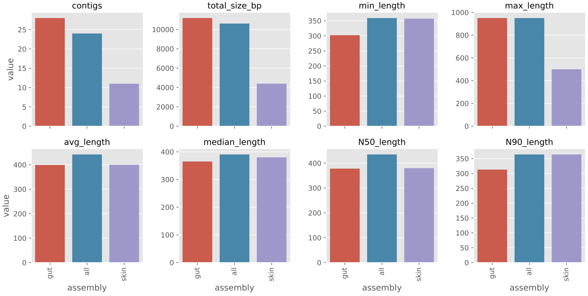

Assembly
========

Assembly can be run as a single part of the workflow using the command::

    snakemake --configfile <yourconfigfile> assembly

`Megahit <https://github.com/voutcn/megahit>`_ is currently the only assembler
supported by this workflow. Specific settings for the assembler are:

:code:`assembly`: Set to True to assemble samples based on the :code:`assemblyGroup` column in your
`sample list <http://nbis-metagenomic-workflow.readthedocs.io/en/latest/configuration/index.html#the-sample-list-file>`_.

:code:`assembly_threads`: Number of threads to use for the assembly software.

:code:`megahit_keep_intermediate:` If set to True, intermediate contigs produced using different k-mer lengths,
as part of the megahit assembly procedure, are stored. Note that this can
take up a large chunk of disk space. By default this is set to False.

:code:`megahit_additional_settings:` The megahit assembler is run with default settings. Use this parameter to
add additional settings to the megahit assembler, such as '--preset meta-large'
or something else that you want to change.

Reports
-------
The workflow produces a set of report files for the assemblies created.
These files are saved in the directory specified by :code:`report_path:` in
your configuration file.

**assembly_stats.pdf**

A multi-panel plot showing number of contigs, total assembly size, as well
as various length statistics of each assembly created.

The figure below shows the plot for the example dataset.

