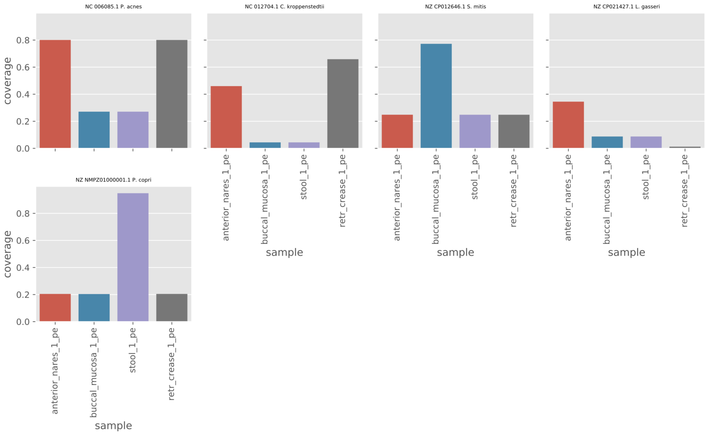
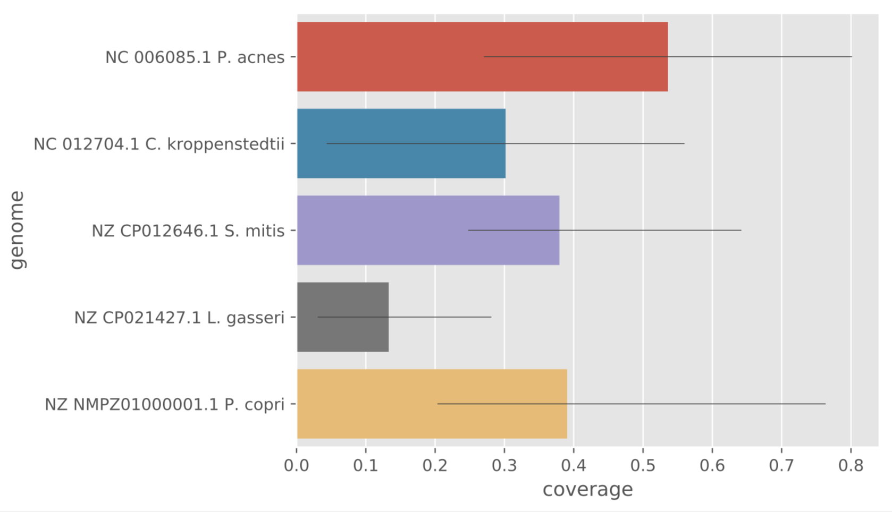

Overview
========
Reads can be classified taxonomically using k-mer based methods. Two
popular programs for this purpose are
`Centrifuge <https://github.com/infphilo/centrifuge>`_ and
`Kraken2 <https://github.com/DerrickWood/kraken2>`_.

Building a database
===================

Database construction for kraken and centrifuge is not part of this workflow. Please refer to the respective
documentation for these tools (`Kraken manual <http://ccb.jhu.edu/software/kraken>`_,
`Centrifuge manual <https://ccb.jhu.edu/software/centrifuge/manual.shtml>`_).

However, both tools have pre-built indices which saves you the trouble of downloading and building these on your own.
By default, the workflow will attempt to download the pre-built index for centrifuge consisting of all prokaryotic and
viral genomes as well as the human genome (:code:`p+h+v`).

Centrifuge
----------

:code:`centrifuge_prebuilt:` By default, the workflow uses the prebuilt :code:`p+h+v` index containing
prokaryotic, viral and human sequences which it will download from the
`centrifuge FTP <ftp://ftp.ccb.jhu.edu/pub/infphilo/centrifuge/data>`_. Other valid choices are:
:code:`p_compressed+h+v`, :code:`p_compressed_2018_4_15`, :code:`nt_2018_2_12` and :code:`nt_2018_3_3`. The index will
be downloaded to :code:`resources/classify_db/centrifuge/`.

:code:`centrifuge_custom:` If you have created your own custom centrifuge index, specify the its path here, excluding
the .*.cf suffix.

:code:`centrifuge_summarize_rank`: The centrifuge index can be summarized to see number of sequences and total size in
bp for each taxa at a certain rank specified by this config parameter (superkingdom by default). To generate the
summary file run::

    snakemake --config centrifuge=True centrifuge_summary

The summary output will be placed in the same directory as the centrifuge index (resources/classify_db/centrifuge if
using the prebuilt index) in a file with the suffix '.summary.tab'.

Kraken2
-------

:code:`kraken_prebuilt`: By default, the workflow uses the prebuilt :code:`MiniKraken2_v2_8GB` database built from the
Refseq bacteria, archaea, and viral libraries and the GRCh38 human genome. Alternatively you can use
:code:`MiniKraken2_v1_8GB` which will download the database excluding the human genome. These minikraken databases
are downsampled versions of the standard database which could influence sensitivity. However,
`evaluations <http://ccb.jhu.edu/software/kraken2/images/Kraken1v2_BuildDBAccuracy_Table.png>`_ suggest that with
kraken2 the drop in sensitivity is minimal.

:code:`kraken_custom`: If you have created your own custom centrifuge index, specify the path to the directory
containing the hash.k2d, opts.k2d and taxo.k2d files.

Classify reads
==============
The workflow will run centrifuge and/or kraken2 (depending on your configuration) on all samples specified in your
`sample annotation file`_ and produce **interactive krona-plots** and **kraken-style reports**.

Individual krona plots are created in results/centrifuge/ and results/kraken/. Combined krona plots are created in
results/report/centrifuge and results/report/kraken. The kraken-style :code:`*.kreport` files created within these
directories can be loaded into the tool `pavian`_. Either install the pavian R package or run it using Docker
(see instructions at the GitHub repo).

Centrifuge
----------
Relevant settings for Centrifuge are:

:code:`centrifuge_max_assignments:` This determines how many assignments are made per read. By default this parameter
is set to 1 in this workflow which means centrifuge runs in 'LCA' mode similar to kraken where only the lowest common
ancestor of all hits is assigned for a read. The default setting for centrifuge is 5.

:code:`centrifuge_min_score:` This is used to filter out classifications when creating the kraken-style report. Note
that this also influences the numbers in the Krona plots.

You can try out the Centrifuge read classifier by using one of the supplied
examples. To see the rules that would be run enter::

    snakemake --configfile examples/centrifuge/config.yaml -np

Now perform the actual run with 4 cores::

    snakemake --configfile examples/centrifuge/config.yaml -p -j 4

Kraken2
-------
Relevant settings for Kraken2 are:

:code:`kraken_reduce_memory:` Set to True to run kraken2 with :code:`--memory-mapping` which reduces RAM usage.

Try out the Kraken2 read classifier using the supplied example::

    snakemake --configfile examples/kraken/config.yaml -np

Filtering results
=================
Sometimes you may see taxa pop up in your classification output that you
are not sure are really there. The k-mer based methods such as Centrifuge
and Kraken do not provide information on e.g. genome coverage that
tools like bowtie2 or blast can give. However, for very large datasets
and very large genome databases using read-aligners is not tractable due
to extremely long running times.

This workflow can utilize the speed and low disk-space requirements of
Centrifuge to obtain a set of 'trusted' genomes that are used for more detailed
mapping analyses.

To try this out on the example above enter::

    snakemake --configfile examples/centrifuge/config.yaml --config centrifuge_map_filtered=True -np -j 4

Because we set :code:`centrifuge_map_filtered=True` the output from Centrifuge is now filtered in a two-step setup.

To perform the actual runs (again with 4 cores) do::

    snakemake --configfile examples/centrifuge/config.yaml --config centrifuge_map_filtered=True -p -j 4

Below are explanations of the different filtering steps and the output produced.

Centrifuge filtering
--------------------
First taxids with at least :code:`centrifuge_min_read_count` assigned reads are identified
and the corresponding genome sequences are extracted from the Centrifuge
database. By default :code:`centrifuge_min_read_count` is set to :code:`5000`.

Sourmash filtering
------------------
Next, genomes passing the first filter are passed to [sourmash](https://github.com/dib-lab/sourmash)
which builds 'MinHash' signatures of the genomes. These signatures are essentially highly
compressed representations of the DNA sequences. Signatures are also computed
for each (preprocessed) sample and these are then queried against the filtered
genome signatures. This gives an estimate of how much a genome is covered by a sample
by comparing the MinHash signatures. Settings which influence how this
filtering step is performed are:

:code:`sourmash_fraction:` the number of hashes to compute as a fraciton of the
input k-mers. By default this is set to :code:`100` meaning that 1/100 of the input
k-mer are used to compute the MinHash signature. Increasing the setting
will reduce the disk-space requirements but may also reduce performance.

:code:`sourmash_min_cov:` This is the minimum coverage estimated from the sourmas filtering
step that a genome must have in order to pass to the next steps. By default
this is set to :code:`0.1` meaning that a genome must be covered by at least 10%
 in at least one of the samples.

Bowtie2 alignments
------------------
Finally, genomes that pass both filters are indexed using bowtie2 and
the (preprocessed) reads are mapped to this set of genomes. The resulting
bam-files are used to calculate coverage of genomes across samples.

Output
------
Under the :code:`results/examples/centrifuge_classify/report/` directory you will
find a :code:`bowtie2` sub-folder with indexed alignment files in bam format
as well as plots of:

genome coverage in each sample and:

average coverage per genome.

In addition, the bam files can be loaded directory into Pavian.
See some instructions [here](https://github.com/fbreitwieser/pavian/blob/master/vignettes/pavian-walkthrough.Rmd#5-alignment-viewer---zoom-into-one-pathogen-in-one-sample).

Note that you will have to increase the `maxUploadSize`of the pavian app in order
to load most bam files. If you installed pavian via R you can run the app as::

    pavian::runApp(port=5000, maxUploadSize=500*1024^2)

.. _pavian: https://github.com/fbreitwieser/pavian
.. _sample annotation file: http://nbis-metagenomic-workflow.readthedocs.io/en/latest/configuration/sample_list.html